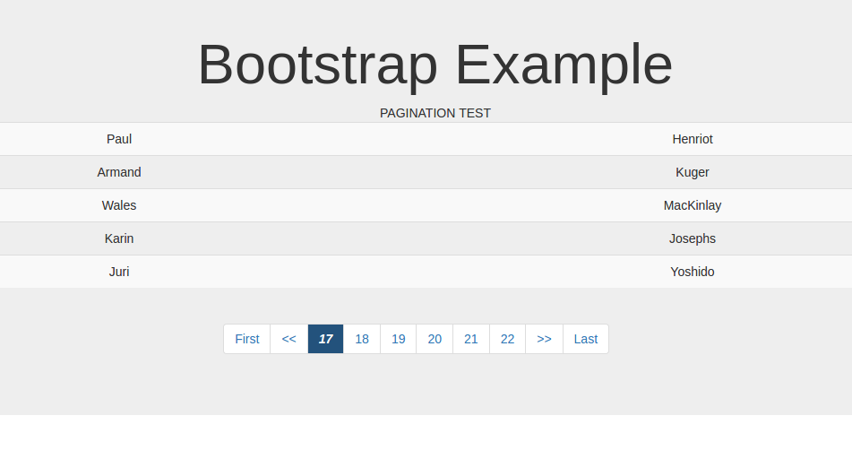

<p align="center">

</p>
# Simple Pagination Class


This is a simple class that implements pagination when connected to a mysql databse via PDO.

  - Include the class
  - Set the name of your table, number of items per page 
  - edit the ouputted html however you want and voila !


It is really easy to set up. No hassle or stress. 


### Requirements

 To work properly, the class needs:

* PHP 5 and above, (tested on PHP 7 but should work flawlessly on PHP 5)
* Web server with PHP and mySQL installed


### Installation

This class requires PHP 5 + to run.

Download and extract  (https://github.com/sayopaul/paginationclass).

Set your config.php file

```sh
<?php
	//set your database comnfiguration here. Ensure to fill in the username and password if there is any.
	define("DSN","mysql:host=dbhost;dbname=dbname");
	define("USER","username");
	define("PASS","password");
```

After that, you create a new PDO object with the config details
```sh
<?php
		//!important ---- require the config file and the Pagination class
		require "config.php";
		include "Pagination.class.php";
		//initialize PDO connection and save object to $db
		try{
			$db=new PDO(DSN,USER,PASS);
		}catch(PDOException $e){
			echo "could not connect because of " .$e ;
		}
		//pass the pdo object,the number of listings per page, and the table name to the class. 
		$paginate = new Pagination($db,5,"customers");
		//call the paginate methods
		$test =$paginate->paginate();
		//print out the returned result
		echo $test;
```
 There's a test file using bootstrap that shows a proper example


### Development

Want to contribute? Great!
Please star and help to identify areas to improve. Thanks 


License
----

MIT


**Free Software, Hell Yeah!**

